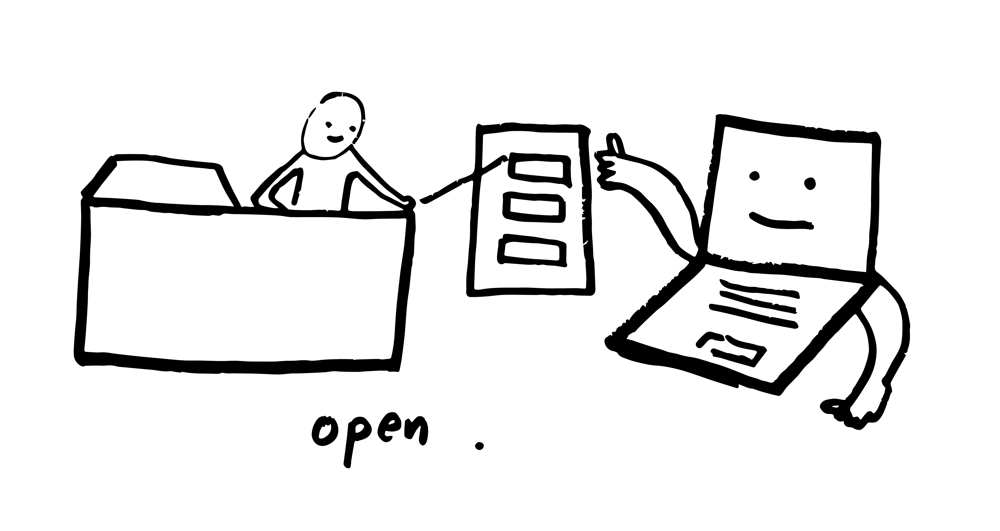

♡ 📂 Folder Poetry Club 📂 ♡
======

Workshop taught by [Melanie Hoff](https://melanie-hoff.com/), co-organized by the [School for Poetic Computation](https://sfpc.io) and [Detroit Community Technology Project](https://detroitcommunitytech.org/).

## Links
- [Folder Poetry Club website](http://folderpoetry.club) 🔗
- [Eventbrite](https://www.eventbrite.com/e/poetic-computation-hands-on-workshop-tickets-61947537753#) 🗓
- [Slides](https://docs.google.com/presentation/d/1RhFLgHCYBBiesn9QeVqSda8diaMUhWPo6istZprdxZs/edit?usp=sharing) 📺
- [Zine PDF](assets/pdf/folder_poetry_zine_pages.pdf) 📖


 
 ## Disclamier
This workshop assumes no coding experience and simultaneously takes the position that everyone who interacts with computers in some way is already a programmer.

### Coding isn’t something that just happens behind your screen. 
Coding _can be_ a holistic computer practice, a new relationship you have with your computer & your computers habits - from the way you name your files or organize your folders, to completely changing how you perform routine tasks on your computer, such as moving a file.

---

## Agenda
- Introductions
    - What is the story of your folder name?
- Intentions
- Longer Introductions
- History of SFPC
- Reintroduction to computers & computing
    - Folder/file systems
- Handy shortcuts
- Sentence activity
- House folder activity
- Bash
    - For loops
    - Bash profile
- Folder Poetry Club

## Vocabulary
**Word** | **Definition**
--- | ---
folder | (also referred to as directory) is an organizational regime imposed on your computer used to store and organize files and other folders
file | is an object on a computer which stores data, information, settings, or commands to be used with various computer programs
file types/formats/extensions | indicate how data has been stored and how to read or open files in specific programs. for example, `.txt` files open in a text editor, `.jpg` files open in an image viewer/editor. full list of file formats and extensions [here](https://en.wikipedia.org/wiki/List_of_file_formats)
file path | tells you the location of a file in a system. for example `users/username/desktop/folder_poetry_club`
terminal | is a way to get text based access to your operating system
terminal commands | give you the ability to control your computer using command prompts. for example, terminal commands on mac computers are written in a language called bash
bash | is the programming language we use in the terminal, often one line at a time, but we can also put bash code in a file and run that file

## File organization
- Naming files and folders
    - All lowercase
    - No spaces, under scores and dashes are ok (for example, `my_folder` or `my-folder`)
- File types
    - `.txt`, `.html`, `.css`, `.js`
- Mind your file path
    - `/../../../../../`

## Handy Shortcuts to sharpen computer habits

| Keyboard Shortcuts for Mac | Description                 |
|----------------------------|-----------------------------|
| cmd + Tab                  | Switch between applications |
| Cmd + Spacebar             | Spotlight search            |
| Cmd + S                    | Save file                   |
| Cmd + Shift + N            | New Folder                  |
| Cmd + Ctl + Spacebar       | Emoji Keyboard              |


## Command line activity
### Open terminal
**What is terminal?**

Terminal is a way to get root level, text based access to your operating system. 

**How do you access it?**
- Type `command + spacebar` to open search
- Type 'terminal' into the search field to open the application

### Bash
**What is bash?**

Bash is the programming language that we use in the terminal, often one line at a time, but we can also put bash code in a file and run that file.

# Commands, codes, spells

## Bash Commands

| Command                                                 | Description                               | Verb   |
|-----------------------------------------|-------------------------------------------|--------|
| `cd`                                      | change directory                          | move   |
| `cd ..`                                   | change directory one level back           | return |
| `ls`                                      | list contents of directory                | look   |
| `pwd`                                     | parent working directory                  | where  |
| `open .`                                  | open folder with finder                   | open   |
| `open filename.txt`                       | opens file in Text Edit                   | open   |
| `cat`                                     | print contents                            | print  |
| `touch filename.txt`                      | create a file named filename.txt          | create |
| `mkdir foldername/`                       | create a folder named filename.txt        | create |
| `rm filename.txt`                         | remove file                               | remove |
| `rm foldername/`                          | remove folder                             | remove |
| `cp filename.txt filename2.txt`           | copy file .                               | copy   |
| `say "hello, what is poetic computation"` | say words out loud    | speak  |
| `man cd`                                  | show the manual for 'cd'. Press q to quit | define |

## Keyboard Commands
| Command         | Description            | Verb     |
|----------------------|------------------------|----------|
| Up + Down Arrow keys | scroll through history | scroll   |
| Tab Key              | autocomplete           | complete |

## Other useful code
| Code                                                        | Description                                          |
|-----------------------------------------------------------------------------------|------------------------------------------------------|
| `open ~/.bash_profile`                                                              | opens your bash profile in a text editor                 |
| `source ~/.bash_profile`                                                            | reloads your bash profile (for after making changes) |
| `export PS1="🌸 \h ✸ \w ⇢ "`                                                        | to change your bash prompt                           |
| `for i in {1..2000}; do printf ' ♡ 📂 → ➩ ➪ ➫ ➬ ➭ ➮  '; done;`                      | to make an emoji for loop                            |                   |
| `bash myfile.sh`                                                                    | to run a bash file                                   |
| `curl sfpc.io`                                                                      | prints the html of a website                         |

### Alias to put in bash_profile

An alias (shortcut) to put in your .bash_profile for viewing folder tree structure:

```alias tree="find . -print | sed -e 's;[^/]*/;|;g;s;|; |;g'"```

An alias to put in your .bash_profile to automatically run an emoji for loop:

```alias folderpoetry="for i in {1..2000}; do printf ' ♡ 📂 → ➩ ➪ ➫ ➬ ➭ ➮ '; done;"``` 

## Folder Poetry Activity
### Download the house
Download the [house](https://drive.google.com/drive/folders/19U9G9hNCWdiwFbkfna20nlhDOoB8uHHg) folder and put it in your computer's home folder. Your home folder or directory on a mac is represented by a house icon 🏠 in finder and by the `~` symbol in terminal. This folder is located near the root of your computer's entire system. Explore the house.

### What is the house?
The house as an example folder structure poem because **using the command line and computing in general is a relational practice**. You are never using the command line from a “global” perspective. When you issue commands from the command line, you are doing so, from a particular position within the hierarchy of your computer’s file system.

Similarly, when we are inside a house, we are never simultaneously in the kitchen and the bedroom. If we tried to “get into bed” while in the kitchen, we would not be able to. However if we wanted to wash dishes while standing in the kitchen, we would be able to.

From the command line, if we have navigated to the Desktop folder but try to perform an action on a file that’s inside your home directory, this would not work. You would have to navigate to the home folder by navigating your file path.

### Make your own file path or file tree
1. After exploring the house together, consider what other narratives you would like to explore with folder structures.
Using the worksheet template or a blank piece of paper in the [zine](assets/pdf/folder_poetry_zine_pages.pdf), take a few minutes to come up with some ideas that are meaningful or interesting to you. For example, [a folder of one's own](http://folderpoetry.club/a/folder/of/ones/own/) and [my fears](http://folderpoetry.club/my-fears/).
2. Share with a partner
3. Using terminal alone, create the folders and files that make up your folder poem
    - Your files can be `.txt`, `.html`, or `.sh`
    - The contents of your files can be words, ideas, thoughts, feelings, emojis, or bash scripts
    - To include emoji icons in your poems, the file must be a `.html` file with the following line included at the top: `<meta charset="utf-8" />`
4. Upload your folder to: [Folder Poetry Club](https://drive.google.com/drive/folders/1U8IcCOcDpxOcaweu5qovpnPAM1KQU8VN?usp=sharing) 📂 
5. Soon, you should see your folder poem live on [folderpoetry.club](folderpoetry.club)

## Full credits
- Curriculum design and workshop by [Melanie Hoff](https://melanie-hoff.com/)
- Zine design, illustrations and workshop support by [Neta Bomani](https://netabomani.com)
- Illustrations and workshop support by [Taeyoon Choi](http://taeyoonchoi.com)
- Workshop support by [Lauren Gardner](http://poohead.com/)
- Space and materials provided by the [Detroit Community Technology Project](https://detroitcommunitytech.org/)

# ♡ 📂 [folderpoetry.club](www.folderpoetry.club) 📂 ♡
